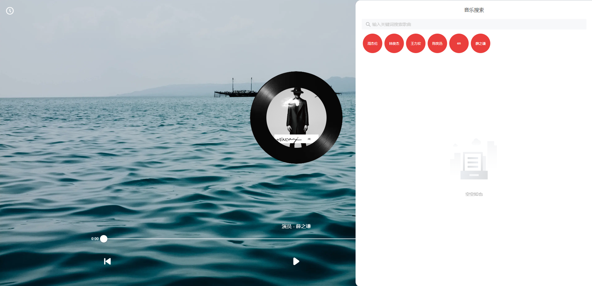

# music-player

music-player 是基于 Vue3+vite+ts开发的音乐播放器，支持web端和移动端。

[传送门](https://songwang-cn.gitee.io/music-player/#/)





## 项目设置

```sh
npm install
```

### 在开发环境中启动和热更新

```sh
npm run dev
```

### 编译用于生产环境

```sh
npm run build
```
